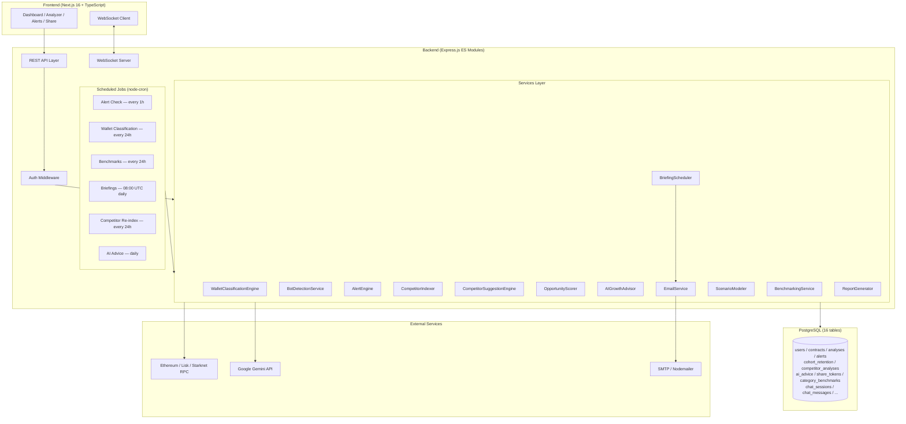
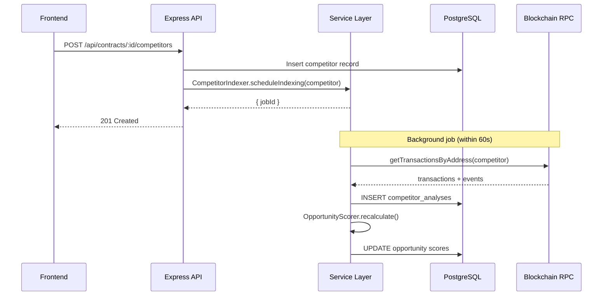

# Design Document: MetaGauge Full Implementation

## Overview

MetaGauge is a Web3 analytics platform that delivers actionable growth intelligence for blockchain protocol founders, product managers, and investors. This design covers the full implementation of all 26 requirements, transforming the current MVP (basic auth, contract onboarding, on-chain indexing, basic dashboard) into a production-grade platform with:

- Real-time indexing progress with accurate WebSocket updates
- PostgreSQL persistence across all 16 tables
- Role-based access control (Admin, Analyst, Viewer)
- Wallet intelligence: classification, cohort retention, bot detection, LTV/RPAW
- Automated alerts engine with competitive alerts
- Competitive intelligence dashboard with opportunity scoring
- CSV/PDF export and shareable read-only links
- AI Growth Advisor with proactive advice and scheduled briefings
- Scenario modeling and category benchmarking
- Public API with OpenAPI docs and JavaScript SDK

The system is built on Node.js + Express.js (ES Modules) for the backend, Next.js 16 + TypeScript + Tailwind + shadcn/ui + Recharts for the frontend, PostgreSQL for persistence, Google Gemini for AI, and Ethereum/Lisk/Starknet via RPC for blockchain data.

---

## Architecture

### High-Level System Architecture



### Request Flow



### Cron Job Schedule

| Job | Schedule | Service |
|-----|----------|---------|
| Alert evaluation | Every hour | AlertEngine |
| Wallet classification | Every 24h | WalletClassificationEngine |
| Category benchmarks | Every 24h | BenchmarkingService |
| Daily briefing | 08:00 UTC | BriefingScheduler |
| Weekly briefing | Monday 08:00 UTC | BriefingScheduler |
| Monthly briefing | 1st of month 08:00 UTC | BriefingScheduler |
| Competitor re-index | Every 24h | CompetitorIndexer |
| AI proactive advice | Daily | AIGrowthAdvisor |

---

## Components and Interfaces

### Backend Services

#### WalletClassificationEngine (`src/services/WalletClassificationEngine.js`)

Classifies every wallet that has interacted with a contract into exactly one segment. Priority order: **Bot → High-risk → Whale → New → Active → Churned**.

```js
class WalletClassificationEngine {
  // Classify all wallets for a contract; returns Map<address, segment>
  async classifyAll(contractId: string): Promise<Map<string, WalletSegment>>

  // Classify a single wallet given its interaction history
  classifyWallet(wallet: WalletHistory): WalletSegment

  // Run full classification pass and persist results
  async runClassificationCycle(contractId: string): Promise<ClassificationResult>
}

type WalletSegment = 'Bot' | 'High-risk' | 'Whale' | 'New' | 'Active' | 'Churned'

interface WalletHistory {
  address: string
  transactions: Transaction[]
  firstInteraction: Date
  lastInteraction: Date
  totalVolume: bigint
  failedTxCount: number
  totalTxCount: number
}
```

Segment rules (applied in priority order):
- **Bot**: >100 txs in any 24h window OR same function + identical input >5 times within 60s
- **High-risk**: failed tx rate > 40%
- **Whale**: top 10 by total transaction volume for the contract
- **New**: first interaction within last 7 days
- **Active**: interacted within last 30 days
- **Churned**: last interaction > 30 days ago

#### BotDetectionService (`src/services/BotDetectionService.js`)

```js
class BotDetectionService {
  // Returns true if wallet exhibits bot patterns
  isBot(wallet: WalletHistory): boolean

  // Returns the triggering heuristic(s) for a bot classification
  getBotHeuristics(wallet: WalletHistory): string[]

  // Evaluate all wallets for a contract after an indexing cycle
  async evaluateContract(contractId: string): Promise<BotEvaluationResult>
}
```

#### AlertEngine (`src/services/AlertEngine.js`)

Runs as a cron job every hour. Compares current metrics against the previous snapshot stored in the DB.

```js
class AlertEngine {
  // Main entry point called by cron
  async checkAllAlerts(userId: string): Promise<Alert[]>

  // Individual alert type checks
  async checkRetentionDrop(contract, config): Promise<Alert | null>
  async checkWhaleExit(contract, config): Promise<Alert | null>
  async checkRevenueChange(contract, config): Promise<Alert | null>
  async checkBotSurge(contract, config): Promise<Alert | null>
  async checkChurnSpike(contract, config): Promise<Alert | null>

  // Competitive alert checks
  async checkCompetitorRetentionSurge(contract, competitor): Promise<Alert | null>
  async checkCompetitorAcquisitionSpike(contract, competitor): Promise<Alert | null>
  async checkWhaleMigration(contract, competitor): Promise<Alert | null>
  async checkTVLOvertake(contract, competitor): Promise<Alert | null>
  async checkMomentumShift(contract, competitor): Promise<Alert | null>

  // Deliver alert via WebSocket
  async deliverAlert(userId: string, alert: Alert): Promise<void>
}
```

Alert evaluation flow:
1. Fetch current metrics snapshot from DB
2. Fetch previous snapshot (1h ago for hourly alerts, 7d ago for weekly)
3. Compare values against configured thresholds (fall back to defaults if not configured)
4. If threshold crossed → INSERT into `alerts` table → emit WebSocket event to user

#### CompetitorIndexer (`src/services/CompetitorIndexer.js`)

Triggered on competitor add; re-runs every 24h via cron.

```js
class CompetitorIndexer {
  // Triggered immediately when a competitor is added
  async scheduleIndexing(competitor: Competitor): Promise<void>

  // Re-index all competitors for all users (called by cron)
  async reindexAll(): Promise<void>

  // Index a single competitor contract
  async indexCompetitor(competitor: Competitor): Promise<CompetitorAnalysis>
}
```

Results stored in `competitor_analyses` table with `type='competitor'`. After each index cycle, triggers `OpportunityScorer.recalculate()` and `AlertEngine.checkCompetitorAlerts()`.

#### CompetitorSuggestionEngine (`src/services/CompetitorSuggestionEngine.js`)

```js
class CompetitorSuggestionEngine {
  // Returns up to 5 suggested competitors based on category + wallet overlap
  async suggest(contractId: string): Promise<CompetitorSuggestion[]>
}
```

#### OpportunityScorer (`src/services/OpportunityScorer.js`)

```js
class OpportunityScorer {
  // Recalculate all opportunity scores after a competitor indexing cycle
  async recalculate(contractId: string): Promise<OpportunityScore[]>

  // Individual score calculations
  scoreFeatureGap(userFunctions: string[], competitorFunctions: string[], adoptionRates: Map<string, number>): number
  scoreUserOverlap(userWallets: Set<string>, competitorWallets: Map<string, WalletLTV>): number
  scoreRetentionPlay(competitorCohorts: CohortRetention[]): number
}

interface OpportunityScore {
  type: 'feature-gap' | 'user-overlap' | 'retention-play'
  score: number  // 0-100
  description: string
  metadata: Record<string, unknown>
}
```

#### AIGrowthAdvisor (`src/services/AIGrowthAdvisor.js`)

Cron job runs daily. Pulls metrics + competitor data, builds a Gemini prompt, stores advice in `ai_advice` table.

```js
class AIGrowthAdvisor {
  // Daily cron entry point
  async generateDailyAdvice(userId: string): Promise<void>

  // Generate advice for a specific trigger condition
  async generateAdvice(trigger: AdviceTrigger): Promise<AIAdvice>

  // Build context prompt for Gemini
  buildPrompt(metrics: ContractMetrics, competitors: CompetitorAnalysis[], trigger: AdviceTrigger): string

  // Reduce advice frequency for thumbs-down types
  async adjustFrequency(userId: string, adviceType: string, feedback: 'up' | 'down'): Promise<void>
}

interface AdviceTrigger {
  type: 'retention-drop' | 'competitor-spike' | 'feature-gap' | 'churn-increase' | 'rpaw-decline' | 'bot-surge'
  metricName: string
  metricValue: number
  contractId: string
  userId: string
}
```

#### BriefingScheduler (`src/services/BriefingScheduler.js`)

Cron jobs: daily at 08:00 UTC, weekly on Monday, monthly on 1st.

```js
class BriefingScheduler {
  // Initialize all cron jobs
  initialize(): void

  async generateDailyBrief(userId: string): Promise<Briefing>
  async generateWeeklyStrategy(userId: string): Promise<Briefing>
  async generateMonthlyBoardSummary(userId: string): Promise<Briefing>

  // Deliver via email + store in-app
  async deliverBriefing(userId: string, briefing: Briefing): Promise<void>
}
```

#### EmailService (`src/services/EmailService.js`)

```js
class EmailService {
  // Send briefing email via nodemailer
  async sendBriefing(to: string, briefing: Briefing): Promise<void>

  // Send alert notification email
  async sendAlert(to: string, alert: Alert): Promise<void>
}
```

#### ScenarioModeler (`src/services/ScenarioModeler.js`)

```js
class ScenarioModeler {
  // Model impact of changing a metric to a target value
  async model(contractId: string, input: ScenarioInput): Promise<ScenarioResult>
}

interface ScenarioInput {
  metric: 'd7_retention' | 'churn_rate' | 'active_wallets' | 'rpaw'
  targetValue: number
}

interface ScenarioResult {
  projectedActiveWallets: number
  projectedMonthlyRevenue: number
  projected90DayGrowthRate: number
  confidence: number  // 0-1
  basedOnSampleSize: number
}
```

#### BenchmarkingService (`src/services/BenchmarkingService.js`)

```js
class BenchmarkingService {
  // Recalculate benchmarks for all categories (called by cron every 24h)
  async recalculateAll(): Promise<void>

  // Calculate benchmarks for a single category
  async calculateCategory(category: string): Promise<CategoryBenchmark[]>

  // Get percentile rank for a contract's metric value
  getPercentileRank(value: number, benchmarks: CategoryBenchmark): number
}
```

### API Routes

| Route | Method | Auth | Description |
|-------|--------|------|-------------|
| `/api/alerts` | GET | Analyst+ | List alerts for user |
| `/api/alerts/:id/acknowledge` | PATCH | Analyst+ | Acknowledge alert |
| `/api/alerts/config` | GET/PUT | Analyst+ | Alert threshold config |
| `/api/contracts/:id/competitors` | GET/POST/DELETE | Analyst+ | Competitor CRUD |
| `/api/analysis/:id/wallet-segments` | GET | Viewer+ | Wallet segment data |
| `/api/analysis/:id/wallet-metrics` | GET | Viewer+ | LTV, RPAW, concentration |
| `/api/analysis/:id/cohort-retention` | GET | Viewer+ | Cohort retention table |
| `/api/analysis/:id/bot-wallets` | GET | Analyst+ | Bot-flagged wallets |
| `/api/analysis/:id/opportunities` | GET | Viewer+ | Ranked opportunities |
| `/api/analysis/:id/export/csv` | GET | Viewer+ | CSV export |
| `/api/analysis/:id/export/pdf` | GET | Viewer+ | PDF export |
| `/api/analysis/:id/share` | POST | Admin | Create share token |
| `/api/share/:token` | GET | None | Read-only shared view |
| `/api/advice` | GET | Viewer+ | AI advice list |
| `/api/advice/:id` | GET | Viewer+ | Single advice item |
| `/api/advice/:id/feedback` | PATCH | Viewer+ | Submit feedback |
| `/api/briefings` | GET | Viewer+ | In-app briefings |
| `/api/scenarios` | POST | Analyst+ | Scenario modeling |
| `/api/benchmarks/:category` | GET | Viewer+ | Category benchmarks |
| `/api/admin/indexing-health` | GET | Admin | Indexing health |
| `/api/admin/audit-log` | GET | Admin | Audit log |
| `/api-docs/openapi.yaml` | GET | None | OpenAPI spec |

### Frontend Components

| Component | Path | Description |
|-----------|------|-------------|
| Alerts page | `frontend/app/alerts/page.tsx` | Alert list + threshold config |
| Share page | `frontend/app/share/[token]/page.tsx` | Read-only shared dashboard |
| Alert list | `frontend/components/alerts/alert-list.tsx` | Severity-badged alert items |
| Alert config | `frontend/components/alerts/alert-config.tsx` | Threshold configuration form |
| Competitive tab | `frontend/components/analyzer/competitive-tab.tsx` | Enhanced with positioning map |
| Opportunities panel | `frontend/components/analyzer/opportunities-panel.tsx` | Ranked opportunity cards |
| Export button | `frontend/components/ui/export-button.tsx` | CSV/PDF export trigger |

---

## Data Models

### New Database Tables (6 additions to existing 10)

#### `alerts`
```sql
CREATE TABLE alerts (
  id              UUID PRIMARY KEY DEFAULT gen_random_uuid(),
  user_id         UUID REFERENCES users(id) ON DELETE CASCADE,
  contract_id     UUID REFERENCES contracts(id) ON DELETE CASCADE,
  alert_type      VARCHAR(50) NOT NULL,
  severity        VARCHAR(20) NOT NULL CHECK (severity IN ('info', 'warning', 'critical')),
  message         TEXT NOT NULL,
  metric_value    DECIMAL,
  threshold       DECIMAL,
  triggered_at    TIMESTAMP DEFAULT NOW(),
  acknowledged_at TIMESTAMP,
  is_read         BOOLEAN DEFAULT false
);
CREATE INDEX idx_alerts_user ON alerts(user_id);
CREATE INDEX idx_alerts_contract ON alerts(contract_id);
CREATE INDEX idx_alerts_triggered ON alerts(triggered_at DESC);
CREATE INDEX idx_alerts_unread ON alerts(user_id, is_read) WHERE is_read = false;
```

#### `cohort_retention`
```sql
CREATE TABLE cohort_retention (
  id           UUID PRIMARY KEY DEFAULT gen_random_uuid(),
  contract_id  UUID REFERENCES contracts(id) ON DELETE CASCADE,
  cohort_week  DATE NOT NULL,
  cohort_size  INTEGER NOT NULL,
  d1_retained  INTEGER NOT NULL DEFAULT 0,
  d7_retained  INTEGER NOT NULL DEFAULT 0,
  d30_retained INTEGER NOT NULL DEFAULT 0,
  d90_retained INTEGER NOT NULL DEFAULT 0,
  calculated_at TIMESTAMP DEFAULT NOW(),
  UNIQUE(contract_id, cohort_week)
);
CREATE INDEX idx_cohort_contract ON cohort_retention(contract_id);
CREATE INDEX idx_cohort_week ON cohort_retention(cohort_week DESC);
```

#### `competitor_analyses`
```sql
CREATE TABLE competitor_analyses (
  id                  UUID PRIMARY KEY DEFAULT gen_random_uuid(),
  user_contract_id    UUID REFERENCES contracts(id) ON DELETE CASCADE,
  competitor_address  VARCHAR(255) NOT NULL,
  competitor_chain    VARCHAR(50) NOT NULL,
  metrics             JSONB NOT NULL DEFAULT '{}',
  indexed_at          TIMESTAMP DEFAULT NOW()
);
CREATE INDEX idx_comp_analyses_contract ON competitor_analyses(user_contract_id);
CREATE INDEX idx_comp_analyses_address ON competitor_analyses(competitor_address, competitor_chain);
CREATE INDEX idx_comp_analyses_indexed ON competitor_analyses(indexed_at DESC);
```

#### `ai_advice`
```sql
CREATE TABLE ai_advice (
  id              UUID PRIMARY KEY DEFAULT gen_random_uuid(),
  user_id         UUID REFERENCES users(id) ON DELETE CASCADE,
  advice_type     VARCHAR(50) NOT NULL,
  content         TEXT NOT NULL,
  trigger_metric  VARCHAR(100),
  trigger_value   DECIMAL,
  delivered_at    TIMESTAMP,
  feedback        VARCHAR(20) CHECK (feedback IN ('up', 'down', NULL)),
  implemented     BOOLEAN DEFAULT false,
  created_at      TIMESTAMP DEFAULT NOW()
);
CREATE INDEX idx_advice_user ON ai_advice(user_id);
CREATE INDEX idx_advice_type ON ai_advice(advice_type);
CREATE INDEX idx_advice_created ON ai_advice(created_at DESC);
```

#### `share_tokens`
```sql
CREATE TABLE share_tokens (
  id          UUID PRIMARY KEY DEFAULT gen_random_uuid(),
  analysis_id UUID REFERENCES analyses(id) ON DELETE CASCADE,
  token       VARCHAR(255) UNIQUE NOT NULL,
  expires_at  TIMESTAMP NOT NULL,
  revoked_at  TIMESTAMP,
  created_at  TIMESTAMP DEFAULT NOW()
);
CREATE INDEX idx_share_token ON share_tokens(token);
CREATE INDEX idx_share_analysis ON share_tokens(analysis_id);
```

#### `category_benchmarks`
```sql
CREATE TABLE category_benchmarks (
  id            UUID PRIMARY KEY DEFAULT gen_random_uuid(),
  category      VARCHAR(50) NOT NULL,
  metric_name   VARCHAR(100) NOT NULL,
  avg_value     DECIMAL,
  p25_value     DECIMAL,
  p50_value     DECIMAL,
  p75_value     DECIMAL,
  p90_value     DECIMAL,
  sample_size   INTEGER NOT NULL DEFAULT 0,
  calculated_at TIMESTAMP DEFAULT NOW(),
  UNIQUE(category, metric_name)
);
CREATE INDEX idx_benchmarks_category ON category_benchmarks(category);
```

### Key Data Flows

#### Wallet Classification Flow
```
IndexingCycle completes
  → WalletClassificationEngine.runClassificationCycle(contractId)
    → Load all wallet interaction histories from analyses table
    → For each wallet: classifyWallet(history) using priority rules
    → Persist segment assignments to wallet_segments JSONB in analyses.results
    → BotDetectionService.evaluateContract(contractId)
    → AlertEngine.checkBotSurge(contractId)
```

#### Share Token Flow
```
POST /api/analysis/:contractId/share
  → crypto.randomBytes(32).toString('hex')  // 64-char hex token
  → INSERT share_tokens (token, analysis_id, expires_at = NOW() + 7 days)
  → Return { shareUrl: '/share/:token' }

GET /share/:token (public, no auth)
  → SELECT * FROM share_tokens WHERE token = $1
  → IF NOT FOUND → 404
  → IF expires_at < NOW() OR revoked_at IS NOT NULL → 410 Gone
  → Fetch analysis data → Return read-only dashboard payload
```

#### Alert Evaluation Flow
```
Cron: every hour
  → For each user → for each contract:
    → Fetch current metrics snapshot
    → Fetch previous snapshot (stored in metrics_snapshots or analyses)
    → Run each alert check function
    → IF threshold crossed AND no duplicate alert in last 1h:
        → INSERT alerts record
        → wsManager.sendToUser(userId, { type: 'alert', data: alert })
        → EmailService.sendAlert() if user has email alerts enabled
```

---

## Correctness Properties

*A property is a characteristic or behavior that should hold true across all valid executions of a system — essentially, a formal statement about what the system should do. Properties serve as the bridge between human-readable specifications and machine-verifiable correctness guarantees.*


### Property 1: Progress Value Range Invariant

*For any* batch progress fraction `p` in [0.0, 1.0] passed to the progress mapping function, the resulting overall progress percentage must be a number in the range [0, 100] inclusive, and the difference between the reported value and the actual completion percentage must not exceed 5 percentage points.

**Validates: Requirements 1.2**

---

### Property 2: Wallet Classification Determinism and Priority

*For any* wallet interaction history, the `classifyWallet` function must:
1. Return exactly one value from the set `{Bot, High-risk, Whale, New, Active, Churned}`
2. Return the same value on every invocation with the same input (deterministic)
3. When a wallet qualifies for multiple segments, return the highest-priority segment according to the order Bot → High-risk → Whale → New → Active → Churned

**Validates: Requirements 5.1, 5.2, 5.3, 5.4, 5.5, 5.6, 5.7, 5.8, 5.9**

---

### Property 3: Cohort Retention Rate Correctness

*For any* cohort with a known `cohort_size` and a known count of wallets that returned within the Dx window, the calculated retention rate must equal `retained_count / cohort_size`, and the retained count for each window (D1: day 1, D7: days 6–8, D30: days 28–32, D90: days 87–93) must include exactly those wallets whose return interaction falls within the window boundaries — no more, no fewer.

**Validates: Requirements 7.2, 7.3, 7.4, 7.5**

---

### Property 4: Cohort Recalculation Idempotence

*For any* contract and cohort_week, running the cohort retention calculation N times (N ≥ 1) must result in exactly one row in the `cohort_retention` table for that (contract_id, cohort_week) pair, with the values from the most recent calculation.

**Validates: Requirements 7.7**

---

### Property 5: Alert Fires If and Only If Threshold Is Crossed

*For any* alert type, current metric value, previous metric value, and configured threshold, the alert engine must trigger an alert if and only if the threshold crossing condition is true — and must not trigger an alert when the condition is false. This must hold for all five alert types: Retention Drop, Whale Exit, Revenue Spike/Dip, Bot Surge, and Churn Spike.

**Validates: Requirements 9.2, 9.3, 9.4, 9.5, 9.6, 9.7, 9.8**

---

### Property 6: CSV Export Data Matches Dashboard Data

*For any* contract and data type (transactions, wallet-segments, cohort-retention), the data values in the CSV export response must be identical to the data values returned by the corresponding dashboard API endpoint for the same contract and time range. No value present in the dashboard response may be absent from or different in the CSV, and vice versa.

**Validates: Requirements 15.4**

---

### Property 7: Share Token Uniqueness and Minimum Length

*For any* N share tokens generated by the system (N ≥ 2), all tokens must be pairwise distinct, and each token must be at least 64 hexadecimal characters long (representing at least 32 bytes of entropy).

**Validates: Requirements 17.1**

---

### Property 8: Share Token Expiry Enforcement

*For any* share token with an `expires_at` timestamp in the past, or with a non-null `revoked_at` timestamp, the system must return HTTP 410 Gone when that token is used to access the shared dashboard. For any token with `expires_at` in the future and `revoked_at` null, the system must return the dashboard data.

**Validates: Requirements 17.3, 17.4, 17.7**

---

### Property 9: Benchmark Percentile Ordering Invariant

*For any* category and metric with a sample size of 3 or more contracts, the calculated benchmark statistics must satisfy: `p25_value ≤ p50_value ≤ p75_value ≤ p90_value`, and `avg_value` must be within the range `[min_value, max_value]` of the input data set.

**Validates: Requirements 24.1**

---

### Property 10: ABI JSON Round-Trip

*For any* valid ABI object, serializing it to a JSON string and then parsing that JSON string back must produce an object that is structurally equivalent to the original (same function names, input/output types, and state mutability values).

**Validates: Requirements 26.2**

---

### Property 11: CSV Transaction Round-Trip

*For any* transaction object, serializing it to a CSV row using the export function and then parsing that CSV row back into a transaction object must produce an object with field values identical to the original transaction object.

**Validates: Requirements 26.4**

---

## Error Handling

### RPC / Blockchain Errors

- All RPC calls use `RpcRetryHelper` with exponential backoff (500ms → 1s → 2s → 5s max)
- Network errors are logged as `console.info` (not `console.error`) to avoid alarming users
- If all RPC endpoints fail after retries, the indexing job is marked `status: 'failed'` with a user-friendly message
- Competitor indexing failures are isolated — one competitor failure does not block others

### Database Errors

- All DB queries use parameterized statements (no string interpolation)
- Connection failures on startup cause process exit with non-zero code
- Upsert operations (cohort retention, benchmarks) use `ON CONFLICT DO UPDATE` to prevent duplicates

### Alert Engine Errors

- If metric snapshot fetch fails for a contract, that contract is skipped for the current cycle (logged, not thrown)
- Duplicate alert suppression: before inserting, check for an existing alert of the same type for the same contract within the last 1 hour

### Share Token Errors

- Expired token → HTTP 410 Gone (not 401 or 404, to distinguish from "never existed")
- Revoked token → HTTP 410 Gone
- Non-existent token → HTTP 404 Not Found

### AI / Gemini Errors

- If Gemini API call fails, the advice item is not stored; the failure is logged and retried on the next daily cycle
- Briefing generation failures do not block other users' briefings (per-user error isolation)

### CSV / PDF Export Errors

- Empty dataset → CSV with header row only (HTTP 200, not 404)
- PDF generation timeout (>30s) → HTTP 504 with retry suggestion
- `fast-csv` used for CSV generation; `pdfkit` used for PDF generation

---

## Testing Strategy

### Dual Testing Approach

Both unit tests and property-based tests are required. They are complementary:
- **Unit tests** verify specific examples, integration points, and edge cases
- **Property tests** verify universal correctness across randomized inputs

### Property-Based Testing

**Library**: `fast-check` (JavaScript/TypeScript PBT library)

Each property test must run a minimum of **100 iterations**. Each test must include a comment tag referencing the design property it validates.

Tag format: `// Feature: metagauge-full-implementation, Property {N}: {property_text}`

| Property | Test File | fast-check Arbitraries |
|----------|-----------|----------------------|
| P1: Progress range | `tests/pbt/progress.test.js` | `fc.float({ min: 0, max: 1 })` |
| P2: Wallet classification | `tests/pbt/wallet-classification.test.js` | Custom `walletHistoryArb` |
| P3: Cohort retention math | `tests/pbt/cohort-retention.test.js` | `fc.array(fc.date())` |
| P4: Cohort idempotence | `tests/pbt/cohort-idempotence.test.js` | `fc.uuid(), fc.date()` |
| P5: Alert threshold | `tests/pbt/alert-threshold.test.js` | `fc.float(), fc.float()` |
| P6: CSV/dashboard consistency | `tests/pbt/csv-consistency.test.js` | Custom `transactionArb` |
| P7: Share token uniqueness | `tests/pbt/share-token.test.js` | `fc.integer({ min: 2, max: 100 })` |
| P8: Share token expiry | `tests/pbt/share-token-expiry.test.js` | `fc.date()` |
| P9: Benchmark percentiles | `tests/pbt/benchmarks.test.js` | `fc.array(fc.float(), { minLength: 3 })` |
| P10: ABI round-trip | `tests/pbt/abi-roundtrip.test.js` | Custom `abiArb` |
| P11: CSV tx round-trip | `tests/pbt/csv-roundtrip.test.js` | Custom `transactionArb` |

### Unit Tests

Unit tests focus on:
- Specific examples demonstrating correct behavior (e.g., a wallet with exactly 101 txs in 24h is classified as Bot)
- Edge cases: empty cohort, category with 2 contracts (no benchmark), expired token exactly at expiry boundary
- Integration points: AlertEngine reading from DB snapshot, BriefingScheduler calling EmailService
- Error conditions: malformed ABI JSON, invalid contract address format, Gemini API timeout

Avoid writing unit tests that duplicate what property tests already cover (e.g., don't write 10 unit tests for different threshold values when P5 covers all values).

### Test Configuration

```js
// Example property test structure
import fc from 'fast-check'
import { classifyWallet } from '../../src/services/WalletClassificationEngine.js'

// Feature: metagauge-full-implementation, Property 2: Wallet classification determinism and priority
test('classifyWallet returns exactly one valid segment for any wallet history', () => {
  const VALID_SEGMENTS = new Set(['Bot', 'High-risk', 'Whale', 'New', 'Active', 'Churned'])
  
  fc.assert(
    fc.property(walletHistoryArb, (history) => {
      const result1 = classifyWallet(history)
      const result2 = classifyWallet(history)
      return VALID_SEGMENTS.has(result1) && result1 === result2
    }),
    { numRuns: 100 }
  )
})
```
